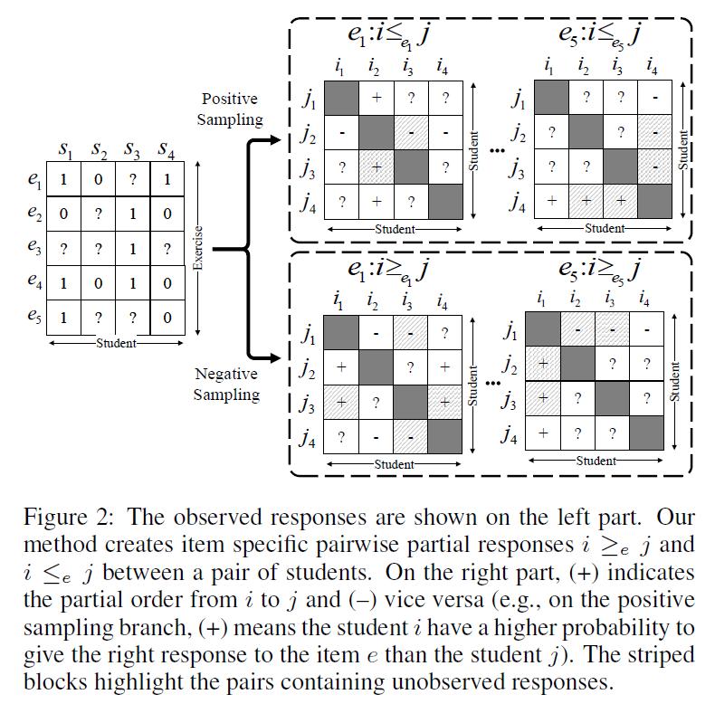

# Item Response Ranking for Cognitive Diagnosis

Cognitive diagnosis, a fundamental task in education area, aims at providing an approach to reveal the proficiency level of students on knowledge concepts. 
Actually, **monotonicity is one of the basic conditions in cognitive diagnosis theory**, which assumes that **student's proficiency is monotonic with the probability of giving the right response to a test item**. 
However, few of previous methods consider the monotonicity during optimization. 
To this end, we propose Item Response Ranking framework (IRR), aiming at introducing pairwise learning into cognitive diagnosis to well model the monotonicity between item responses. 
Specifically, we first use an item specific sampling method to sample item responses and construct response pairs based on their partial order, where we propose the two-branch sampling methods to handle the unobserved responses (see Figure 2). 
After that, we use a pairwise objective function to exploit the monotonicity in the pair formulation. 
In fact, IRR is a general framework which can be applied to most of contemporary cognitive diagnosis models.

We provide some examples for better illustration:

* [IRR-IRT](../examples/IRR/IRT.ipynb)
* IRR-DINA (TBA)
* IRR-NCD (TBA)

In the following parts, we will simply introduce the basic lemma `pairwise monotonicity` and training procedure. 
For the readers who want to know more about our work, they can find the paper in ijcai21.

## Pairwise Monotonicity

In the literature, the monotonicity theory assumes that student's proficiency is monotonic with the probability of giving  the  right  response to a test item.
We rewrite it in a pairwise perspective: a more skilled student should have a higher probability to give the right response to a test item than an unskilled one. Formally, we have the following pairwise monotonicity:

### Pairwise Monotonicity

_Given a specific test item, the students with right responses are more skilled than those with wrong responses._

## Learning Model with IRR

We first design an item specific pair sampling method to resolve the potential non-overlapped problem, i.e., sampling responses from different students to the same item to keep related knowledge concepts the same. 
Then, to handle the unobserved responses along with the observed responses, we conduct a two-branch sampling method, i.e., positive sampling and negative sampling.
After that, based on the sampled pairs, we introduce the pairwise learning to model the partial order among response pairs, where we use a pairwise objective function to better optimize the monotonicity.

The objective function of IRR is:

$$
min_{\Theta} - \mathop{ln} IRR + \lambda(\Theta),
$$
where $\lambda(\Theta)$ is the regularization term and $\lambda$ is a hyper-parameter. We can apply IRR to any fully differentiable CDMs (e.g., MIRT) and train them with Stochastic Gradient Descent.
